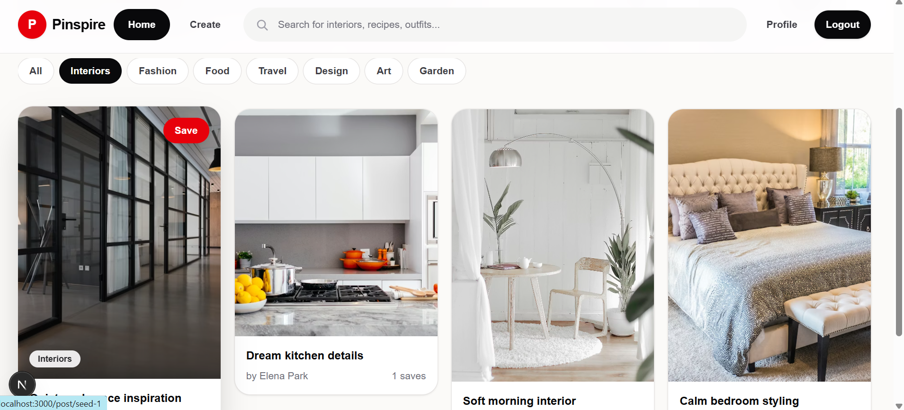
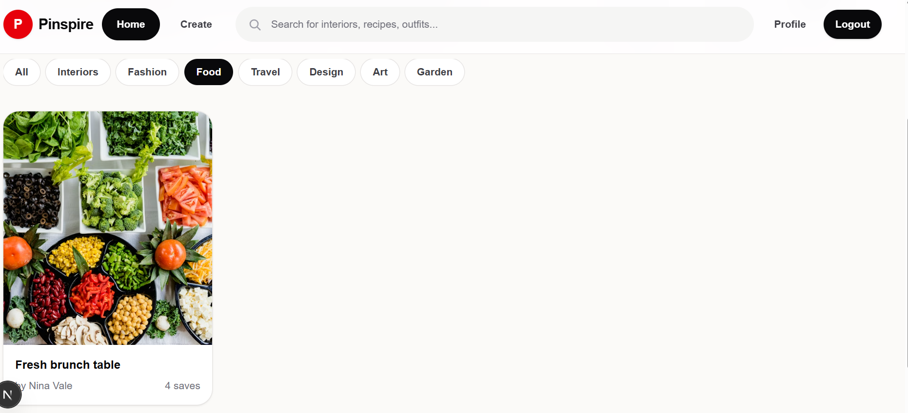
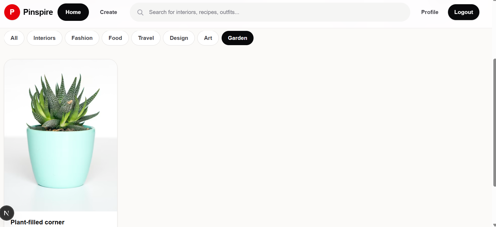
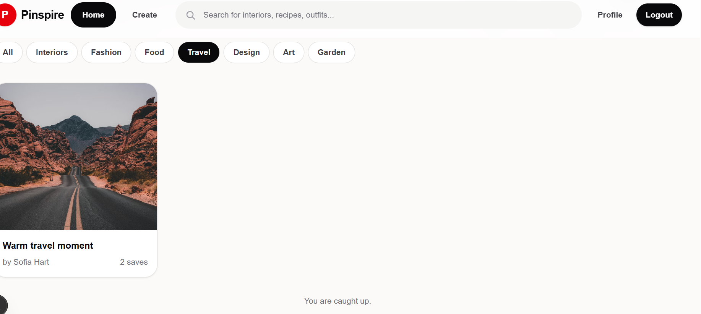

# Pinspire - Pinterest Clone


Pinspire is a full-stack Pinterest-inspired image discovery platform where users can browse visual ideas, filter pins by category, create posts, save inspiration, like content, and view user profiles. The project demonstrates a modern MERN-style architecture with a Next.js frontend, Express REST API, MongoDB persistence, JWT authentication, and Cloudinary-ready image uploads.

Built as a portfolio-ready web application, Pinspire focuses on clean UI, authenticated user flows, scalable backend routing, and practical full-stack engineering patterns.

## Screenshots

### Interiors Feed



### Food Feed



### Garden Feed



### Travel Feed



## Key Features

- User registration and login with JWT authentication
- Password hashing with bcrypt
- Category-based pin browsing
- Search-ready post filtering by title, description, and tags
- Create pins with image file upload or image URL
- Save and unsave pins
- Like and unlike posts
- Add comments to posts
- View individual post details
- User profile pages with created and saved posts
- Paginated backend post feed
- Cloudinary integration support with local upload fallback
- Centralized Express error handling
- Responsive Next.js frontend

## Tech Stack

| Layer | Technology |
| --- | --- |
| Frontend | Next.js 16, React 19 |
| Styling | Tailwind CSS |
| Backend | Node.js, Express.js |
| Database | MongoDB, Mongoose |
| Authentication | JSON Web Tokens, bcryptjs |
| File Uploads | Multer, Cloudinary |
| API Style | REST |
| Tooling | ESLint, Nodemon |

## Architecture and Workflow

Pinspire uses a separated frontend and backend architecture.

1. The Next.js frontend renders the user interface and stores the authenticated session in `localStorage`.
2. API requests are sent to the Express backend through the configured `NEXT_PUBLIC_API_URL`.
3. The backend validates requests, handles authentication middleware, and communicates with MongoDB through Mongoose models.
4. Protected routes require a Bearer token generated during login or registration.
5. Uploaded images are handled through Multer and can be stored through Cloudinary when credentials are configured.
6. Post data, users, comments, likes, and saves are persisted in MongoDB.

## Folder Structure

```text
PINTEREST-CLONE/
|-- backend/
|   |-- server.js
|   |-- package.json
|   `-- src/
|       |-- app.js
|       |-- config/
|       |   |-- cloudinary.js
|       |   `-- db.js
|       |-- controllers/
|       |   |-- authController.js
|       |   |-- postController.js
|       |   `-- userController.js
|       |-- middleware/
|       |   |-- authMiddleware.js
|       |   `-- errorHandler.js
|       |-- models/
|       |   |-- Post.js
|       |   `-- User.js
|       |-- routes/
|       |   |-- authRoutes.js
|       |   |-- postRoutes.js
|       |   `-- userRoutes.js
|       |-- uploads/
|       `-- utils/
|           |-- generateToken.js
|           `-- upload.js
|-- frontend/
|   |-- package.json
|   |-- next.config.mjs
|   `-- src/
|       |-- app/
|       |   |-- page.js
|       |   |-- login/
|       |   |-- register/
|       |   |-- upload/
|       |   |-- post/[id]/
|       |   `-- profile/[id]/
|       |-- components/
|       |-- data/
|       `-- lib/
|-- screenshots/
|-- README.md
`-- package.json
```

## Installation

### Prerequisites

- Node.js 18 or higher
- npm
- MongoDB database
- Cloudinary account for hosted image uploads

### Clone the Repository

```bash
git clone https://github.com/vinjammadhusai/PINTEREST-CLONE.git
cd PINTEREST-CLONE
```

### Install Backend Dependencies

```bash
cd backend
npm install
```

### Install Frontend Dependencies

```bash
cd ../frontend
npm install
```

## Environment Setup

Create a `.env` file inside the `backend` directory:

```env
PORT=5000
MONGO_URI=mongodb://127.0.0.1:27017/pinterest_clone
JWT_SECRET=replace_with_a_secure_secret
JWT_EXPIRES_IN=7d
CLOUDINARY_CLOUD_NAME=your_cloud_name
CLOUDINARY_API_KEY=your_api_key
CLOUDINARY_API_SECRET=your_api_secret
CLIENT_URL=http://localhost:3000
```

Create a `.env.local` file inside the `frontend` directory:

```env
NEXT_PUBLIC_API_URL=http://localhost:5000/api
```

## Usage

Start the backend API:

```bash
cd backend
npm run dev
```

The backend runs on:

```text
http://localhost:5000
```

Start the frontend app in another terminal:

```bash
cd frontend
npm run dev
```

The frontend runs on:

```text
http://localhost:3000
```

Open the app in your browser, create an account, browse categories, upload a pin, and interact with posts.

## API Endpoints

Base URL:

```text
http://localhost:5000/api
```

| Method | Endpoint | Access | Description |
| --- | --- | --- | --- |
| GET | `/health` | Public | Check API status |
| POST | `/auth/register` | Public | Register a new user |
| POST | `/auth/login` | Public | Login an existing user |
| GET | `/posts` | Public | Get paginated posts |
| GET | `/posts/:id` | Public | Get a single post and increment views |
| POST | `/posts` | Protected | Create a new post |
| PATCH | `/posts/:id/like` | Protected | Like or unlike a post |
| PATCH | `/posts/:id/save` | Protected | Save or unsave a post |
| POST | `/posts/:id/comments` | Protected | Add a comment to a post |
| GET | `/users/:id` | Public | Get user profile, created posts, and saved posts |

### Query Parameters for Posts

| Parameter | Example | Description |
| --- | --- | --- |
| `page` | `1` | Page number |
| `limit` | `12` | Number of posts per page, maximum 30 |
| `category` | `Travel` | Filter posts by category |
| `search` | `workspace` | Search title, description, and tags |

Example:

```text
GET /api/posts?page=1&limit=12&category=Interiors&search=kitchen
```

## Example Requests and Responses

### Register User

```bash
curl -X POST http://localhost:5000/api/auth/register \
  -H "Content-Type: application/json" \
  -d '{
    "name": "Demo User",
    "email": "demo@example.com",
    "password": "password123"
  }'
```

Example response:

```json
{
  "user": {
    "id": "USER_ID",
    "name": "Demo User",
    "email": "demo@example.com",
    "avatar": "",
    "bio": ""
  },
  "token": "JWT_TOKEN"
}
```

### Create Post

```bash
curl -X POST http://localhost:5000/api/posts \
  -H "Authorization: Bearer JWT_TOKEN" \
  -F "title=Warm travel moment" \
  -F "description=Road trip inspiration" \
  -F "category=Travel" \
  -F "tags=travel,roadtrip,inspiration" \
  -F "imageUrl=https://example.com/image.jpg"
```

Example response:

```json
{
  "_id": "POST_ID",
  "title": "Warm travel moment",
  "description": "Road trip inspiration",
  "imageUrl": "https://example.com/image.jpg",
  "category": "Travel",
  "tags": ["travel", "roadtrip", "inspiration"],
  "likes": [],
  "saves": [],
  "comments": []
}
```

### Get Posts

```bash
curl "http://localhost:5000/api/posts?page=1&limit=12&category=Food"
```

Example response:

```json
{
  "posts": [],
  "page": 1,
  "hasMore": false,
  "total": 0
}
```

## Deployment

### Frontend Deployment

The frontend can be deployed to Vercel, Netlify, or any platform that supports Next.js.

Recommended Vercel settings:

| Setting | Value |
| --- | --- |
| Root Directory | `frontend` |
| Build Command | `npm run build` |
| Output | Next.js default |
| Environment Variable | `NEXT_PUBLIC_API_URL=https://your-api-domain.com/api` |

### Backend Deployment

The backend can be deployed to Render, Railway, Fly.io, or any Node.js hosting provider.

Recommended backend settings:

| Setting | Value |
| --- | --- |
| Root Directory | `backend` |
| Build Command | `npm install` |
| Start Command | `npm start` |
| Port | `5000` or provider-assigned `PORT` |

Make sure the backend environment includes MongoDB, JWT, Cloudinary, and `CLIENT_URL` values.

## GitHub Repository Setup

Use the following commands to initialize a local repository and push it to GitHub:

```bash
git init
git add .
git commit -m "Initial commit"
git branch -M main
git remote add origin <repo-url>
git push -u origin main
```

For this project:

```bash
git remote add origin https://github.com/vinjammadhusai/PINTEREST-CLONE.git
git push -u origin main
```

## Engineering Decisions and Challenges Solved

- Separated frontend and backend concerns for clearer deployment and maintainability.
- Added JWT middleware to protect create, like, save, and comment actions.
- Used Mongoose references and population to return useful owner and comment user data.
- Implemented paginated post retrieval to keep the feed scalable.
- Supported both uploaded image files and external image URLs for flexible pin creation.
- Added centralized error handling to keep API responses consistent.
- Designed category filtering and search logic at the API layer for reusable frontend behavior.

## Future Improvements

- Add automated unit and integration tests
- Add image optimization and moderation workflow
- Add edit and delete actions for user-owned posts
- Add follow/unfollow user functionality
- Add advanced profile editing
- Add infinite scroll loading states and skeleton UI
- Add production logging and request rate limiting
- Add CI/CD workflow with GitHub Actions

## Contributing

Contributions are welcome. To contribute:

1. Fork the repository.
2. Create a feature branch.
3. Make your changes.
4. Commit with a clear message.
5. Push your branch.
6. Open a pull request.

Please keep changes focused, readable, and consistent with the existing project structure.

## License

This project is licensed under the ISC License.

## Author

**Madhu Sai Vinjam**

- GitHub: [@vinjammadhusai](https://github.com/vinjammadhusai)
- Repository: [PINTEREST-CLONE](https://github.com/vinjammadhusai/PINTEREST-CLONE)
