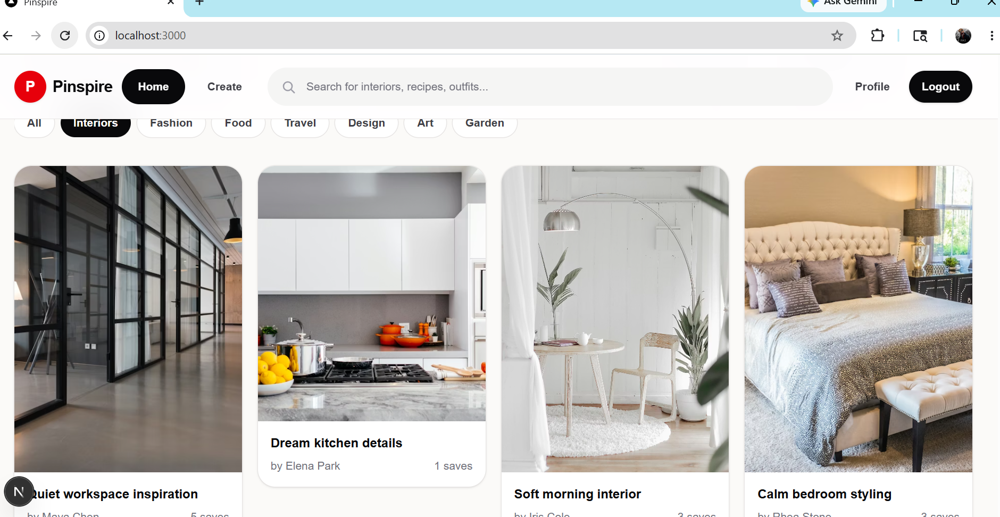
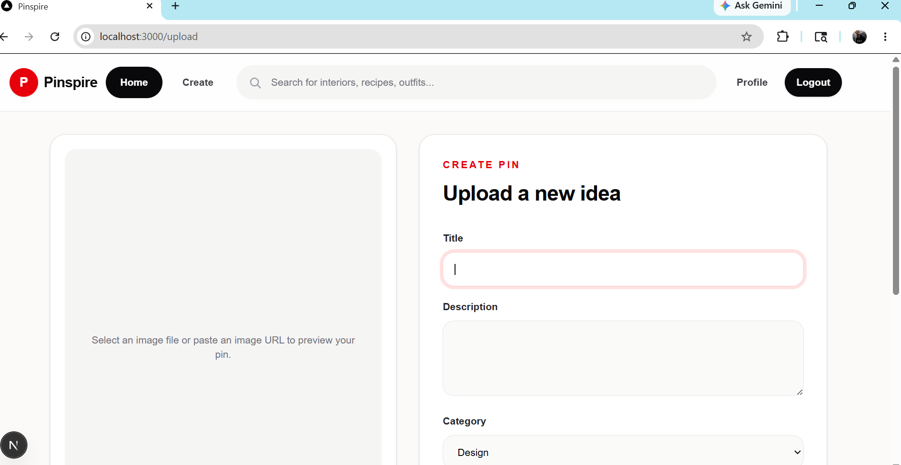

# Pinterest Clone

A full-stack Pinterest-inspired web application built with Next.js, React, Node.js, Express, MongoDB, and Cloudinary.

## Screenshots

### Home Feed



### Create Pin



## Features

- User registration and login
- JWT-based authentication
- Home feed with pin cards
- Upload posts with images
- User profile pages
- Individual post detail pages
- Cloudinary image upload support
- MongoDB data storage

## Tech Stack

- Frontend: Next.js, React, Tailwind CSS
- Backend: Node.js, Express.js
- Database: MongoDB with Mongoose
- Authentication: JSON Web Tokens
- Image Storage: Cloudinary

## Project Structure

```text
PINTEREST-CLONE/
  backend/     Express API, models, routes, controllers, uploads
  frontend/    Next.js application
```

## Getting Started

### 1. Install dependencies

Install backend dependencies:

```bash
cd backend
npm install
```

Install frontend dependencies:

```bash
cd ../frontend
npm install
```

### 2. Configure environment variables

Create a `.env` file inside the `backend` folder:

```env
PORT=5000
MONGO_URI=your_mongodb_connection_string
JWT_SECRET=your_jwt_secret
JWT_EXPIRES_IN=7d
CLIENT_URL=http://localhost:3000
CLOUDINARY_CLOUD_NAME=your_cloudinary_cloud_name
CLOUDINARY_API_KEY=your_cloudinary_api_key
CLOUDINARY_API_SECRET=your_cloudinary_api_secret
```

Create a `.env.local` file inside the `frontend` folder:

```env
NEXT_PUBLIC_API_URL=http://localhost:5000/api
```

### 3. Run the backend

```bash
cd backend
npm run dev
```

The API runs at:

```text
http://localhost:5000
```

### 4. Run the frontend

Open a second terminal:

```bash
cd frontend
npm run dev
```

The app runs at:

```text
http://localhost:3000
```

## Available Scripts

Backend:

```bash
npm run dev
npm start
```

Frontend:

```bash
npm run dev
npm run build
npm start
npm run lint
```

## License

This project is licensed under the ISC License.
